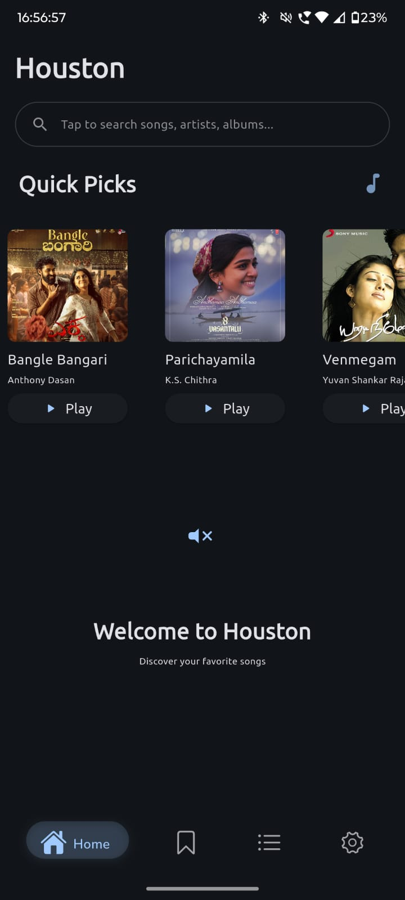
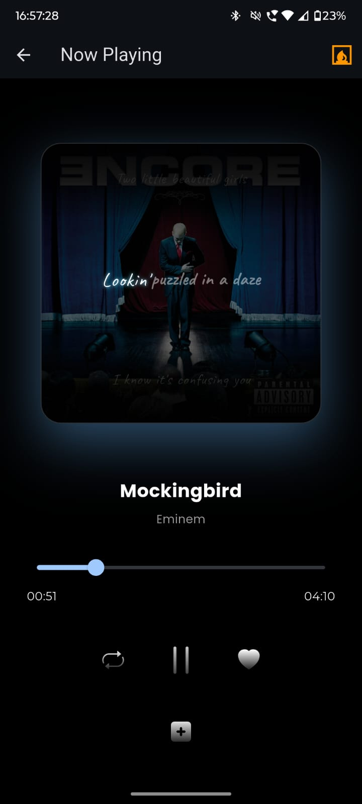
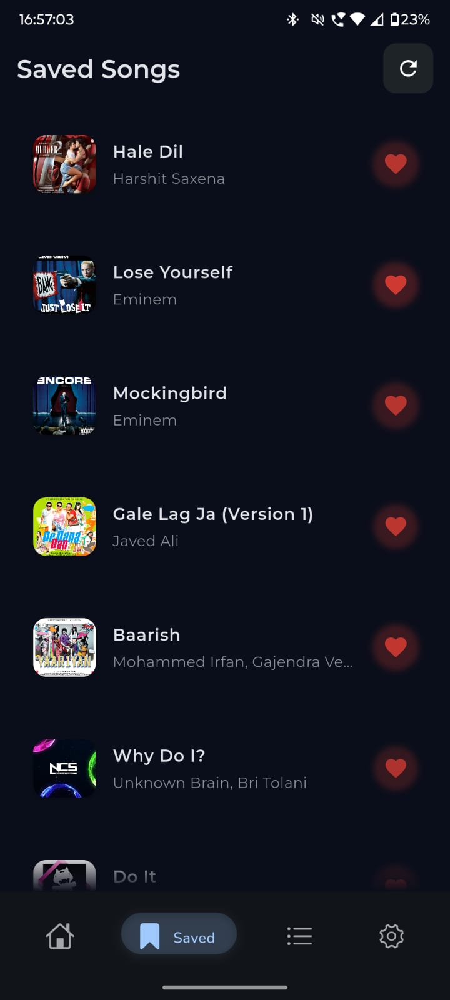
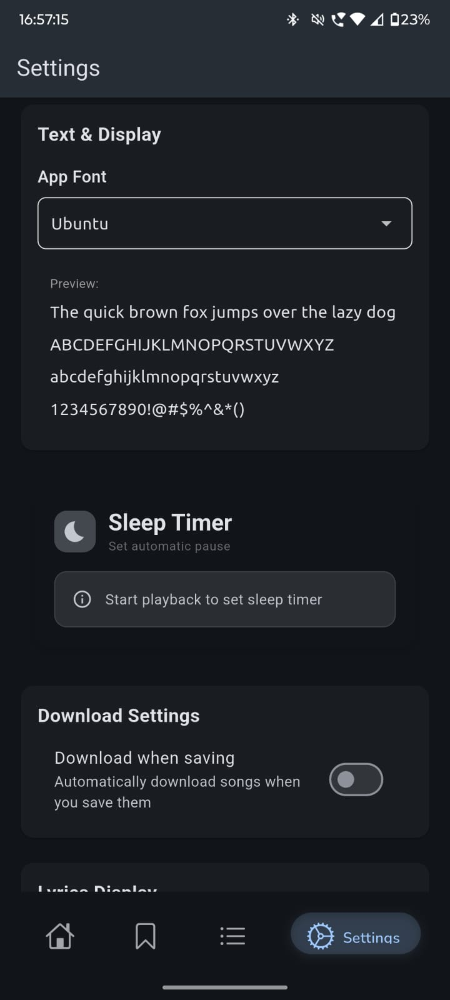

# 🚀 Houston

<div align="center">

[](https://github.com/golanpiyush/houston-app/releases/latest)
[](https://github.com/golanpiyush/houston/blob/main/LICENSE)


WARNING!

⚠️Houston's engine is failing as it's governed by an older version of the search engine. the new engine is out but will not be implemented as I don't understand the code myself anymore 🫡🍺


**A modern, minimal, offline-capable music player built for knowledge-seekers, not time wasters.**

*Material 3 design • Offline + online sync • EQ & effects • In-app updates • Radio streaming*

</div>
<div align="center">
  
</div>

## 🎯 Overview

Houston is a powerful Android music player that combines the best of local and remote playback in one seamless experience.  
Inspired by **YouTube Music's interface** but designed for users who value **privacy**, **offline capability**, and **advanced audio controls**.

---
## ✨ Features

### 🎵 **Core Playback**
- **Unified Queue System** – Mix local and remote tracks seamlessly
- **Multiple Queue Management** – Create, save, and switch between playlists
- **Advanced Queue Editing** – Drag & drop reordering with undo
- **Background Playback** – With Media controls 


### 🌐 **Connectivity & Sync**
- **Hybrid Playback** – Local files + streaming
- **Smart Fallback** – Auto-switch source on failure
- **Advanced Sync** – Playlist & library sync with conflict resolution
- **Radio Streaming** – Support for custom stations based on one particular song (Under Development)

### 🔧 **Advanced Features**
- **In-App Updates** – Auto-update via GitHub releases with rollback protection
- **Offline Downloads** – Cache management & explicit offline mode


---

## 📱 Installation

### Quick Install
1. 📥 Download the latest APK from [Releases](https://github.com/golanpiyush/houston-app/releases/latest)
2. ⚙️ Enable **installation from unknown sources** in Android settings
3. 📲 Install by tapping the APK
4. 🔄 Future updates handled by **in-app updater**

### Required Permissions
- 📁 **Storage** – Local music playback
- 🔔 **Notifications** – Media controls
- 🌐 **Network** – Streaming & updates
- 🔐 **Account Sync** *(Optional)* – Cloud sync


## 🤖 Plugin/s used
- https://github.com/golanpiyush/yt_flutter_musicapi
---
## 🎨 Screenshots

<details>
<summary>📸 View Screenshots</summary>

<div align="center">
  
  
  
  
  
</div>

</details>


## 🛠️ Building from Source

### Prerequisites
- **Android Studio** Arctic Fox or later
- **JDK 11+**
- **Android SDK 30+**

### Build Steps
```bash
# Clone the repository
git clone https://github.com/golanpiyush/houston-app.git
cd houston-app

# Build debug version
./gradlew assembleDebug

# Build release version (requires signing)
./gradlew assembleRelease

# Install directly to a connected device
./gradlew installDebug
